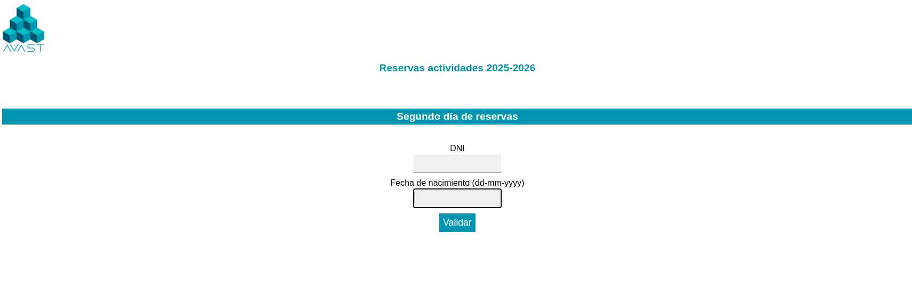
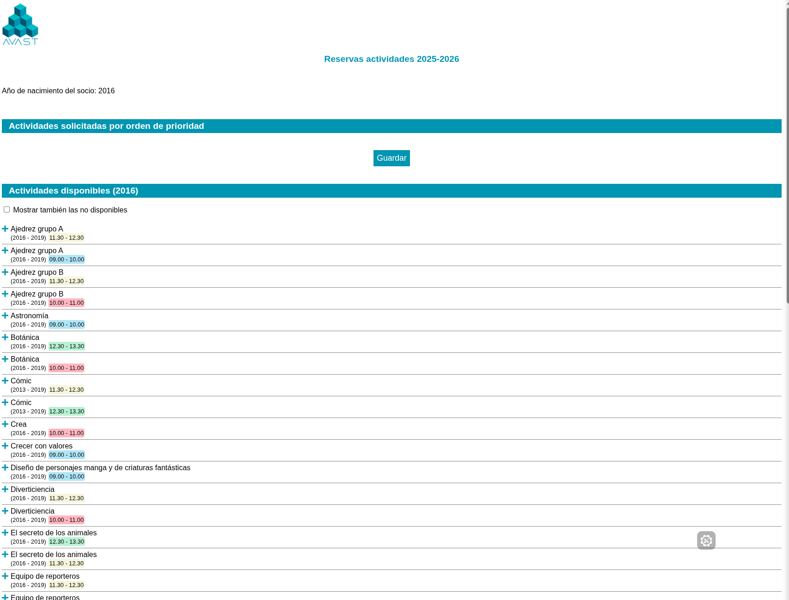
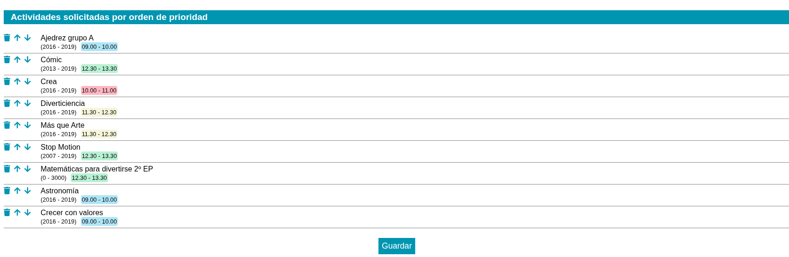
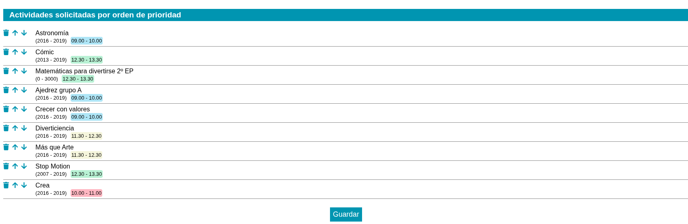
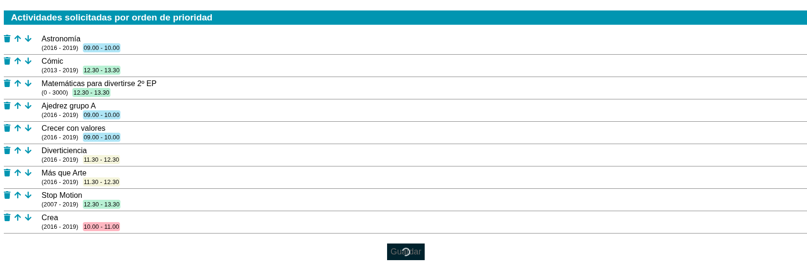

# Asignación de talleres

## Introducción

[AVAST](https://www.asociacion-avast.org) cuenta en estos momentos con 1732 socios, de los cuales hay más de 1000 en la categoría con actividades. Cada socio, en los sábados de talleres, puede asistir hasta a un máximo de 4 talleres, por lo que, durante los procesos de inscripción en talleres, generalmente en Septiembre que es cuando más socios se inscriben, y también, pero en menor medida, en Enero, significa que se producen accesos simultáneos a la aplicación PlayOff que utilizamos para la gestión y que provoca que el servidor no sea capaz de gestionar la carga de trabajo y se produzcan errores en la aplicación.

Pensemos, que 4 talleres, por 1000 socios, son más de 4000 inscripciones así como cambios de parecer, personas que utilizan más de un dispositivo por socio contraviniendo las indicaciones de la asociación, etc.

En las ocasiones pasadas, esto llevó a una caída completa del servidor durante varias horas, resultando en muchos socios que no pudieron inscribirse en los talleres, unido a otros errores relativos al número de plazas libres que no estaba bien reflejado en la aplicación etc.

## Guía gráfica del proceso

Si, aquí tienes los pasos del proceso:

### Login

Entra en [Reservas Actividades](https://admin.asociacion-avast.org/reservas) y haz login con los datos de PlayOff.

### Selecciona los talleres:

Lista inicial vacía:

Lista con talleres añadidos:

### Ordena los talleres por prioridad

Usa las flechas para subir, bajar o eliminar el taller de la lista

### Guarda la lista presionando el botón guardar

### Proceso finalizado

Si has hecho los pasos anteriores, ahora ya tenemos la lista de talleres priorizada y guardada y es cuestión de esperar a finalizar el proceso de asignación de talleres.

## La propuesta implementada

De cara a evitar este problema, se propuso y se presentó ya en Familias en Acción la siguiente aproximación a la resolución del problema::

1. Los socios harían una lista priorizada de talleres a los que quieren asistir, una lista con tantos elementos como quisieran.
1. Se utilizaría el número agraciado en la ONCE o cualquier otro sorteo oficial como semilla del generador aleatorios del equipo donde se realizaría la asignación.
1. Un [programa](https://github.com/asociacion-avast/inscripciones-assign/blob/main/asignar.py), ordenaría (método Durstenfeld) la lista de socios de forma aleatoria usando ese número de semilla y una vez realizada esa ordenación, comenzaría a coger la lista priorizada de cada socio e iría asignando por orden talleres de forma que:
   1. Se coge la lista de socios y se validan de forma que:
      1. El socio está en estado de ALTA y VALIDADO en PlayOff
      2. Que el socio está dado de alta en la modalidad con actividades
      3. Que el socio ha rellenado una lista de preferencias para talleres
   2. Se ordena la lista de socios como se ha explicado en el paso anterior
   3. Por cada socio de esa lista:
      1. Se procesa la lista de preferencias del socio, se coge la primera opción y se comprueba que:
         1. El taller tiene plazas libres
         2. Que el rango de edad corresponde con la edad del socio
         3. El socio no tiene conflictos de horario con otros talleres ya inscritos
         4. Que el socio no tiene ya inscrito un taller similar
      2. Si todo el paso anterior es correcto, se procede a asignar ese taller al socio, en caso contrario, se repite con la siguiente opción de su lista de preferencias hasta que o bien se inscribe en un taller o bien, no hay talleres compatibles.
      3. Se pasa al siguiente socio y se repite el proceso hasta procesar la lista completa.
   4. Al final de la primera ejecución, donde generalmente, cada socio ha recibido un taller de su lista, se acaba el proceso.
1. Al día siguiente, se repite todo el proceso desde el principio, con una nueva semilla aleatoria y una nueva ordenación, y se procesan los socios. 3. De nuevo, para cada socio, que como ya tenía un taller de su lista y otros que podían haber quedado excluidos por plazas, por edad, etc, se siguen excluyendo hasta encontrar un taller que le pueda corresponder y así con todos los socios.
1. Al tercer día se repite de nuevo todo el proceso.
1. Al cuarto día se vuelve a repetir, y dado que otros talleres ya están ocupados es cuando tenemos más riesgo de no tener talleres de su lista priorizada compatibles, por lo que se pueden quedar plazas sin asignar.

## Qué hacer como padres

El resumen rápido es:

- Registra en [Reservas Actividades](https://admin.asociacion-avast.org/reservas) con los datos de PlayOff y:
- Asegúrate de tener una lista priorizada... es decir...
  - El orden de talleres, tanto por horario como por nombre es importante:
    - Si quieres Astronomía, pon en tus cuatro primeros lugares de preferencia `Astronomía`, y si la prefieres, por ejemplo de `10:05 a 11:05`, pones esa como primera opción.
    - Si no consigues `Astronomía` a las 10:00, pero te vale a las 9:00, la pones en segundo lugar, y si por ejemplo no tienes esos dos horarios (por edad, por interés, etc), pues ya pones otro taller que quieras en la hora que quieras.
- Cada día podrá editarse la lista de prioridades, pero si lo has hecho bien, la lista que hiciste vale para todos los días (y lo lógico es que fuera esa la operativa)
- Cuando se hayan realizado las 4 rondas de asignación, se activará en PlayOff ver las inscripciones, hasta ese punto no se podrán ver y si se hiciera alguna inscripción manual, se anularía.
- Una vez todos los socios tengan las inscripciones cargadas en PlayOff, el proceso de anulación de inscripciones o inscripción manual a otros talleres se abrirá y podrá gestionarse desde la aplicación como otros años siempre que haya plazas libres.

## Advertencias

- El código del proceso de asignación está indicado en el enlace anterior, cualquiera puede revisarlo para auditarlo
- El proceso de asignación es completamente aleatorio, no se tiene en cuenta el número de socio, ni la antigüedad, ni nada que no sea la lista de preferencias, el número de plazas libres, año de nacimiento y que no haya inscripciones en talleres similares.

## Preguntas frecuentes

### ¿Puedo cambiar la lista de preferencias?

Si, cada día podrás cambiarla, pero como hemos explicado, si lo has hecho bien, no debería ser necesario porque es una lista de preferencias, similar a lo que haces cuando indicas centro educativo para matricular a los niños.

### ¿Puedo cambiar la lista de preferencias una vez asignados los talleres?

No, una vez asignados los talleres, la lista de preferencias ya no es necesaria, y lo gestionarás desde PlayOff como se venía haciendo hasta ahora.

### ¿Depende de tener un dispositivo más rápido, de un sistema operativo concreto o de la velocidad de internet los talleres en los que se apuntará mi hijo?

No, el proceso se ha diseñado para que cualquiera pueda desde cualquier dispositivo generar la lista de preferencias y que todos los factores que otras veces afectaban o podían afectar no lo hagan, ya que se desacopla la lista de prioridades de conseguir un taller u otro.

### ¿Me puedo quejar si no tengo los talleres que quería?

El proceso de asignación es completamente aleatorio y el código que lo realiza es público, la asignación se hace en base a los criterios, así que si no tienes lost talleres que querías, es muy probable que tuvieras mala suerte con el orden de asignación o que fueran talleres más solicitados.

Estad atentos a los anuncios de plazas liberadas en el chat de `Familias/Talleres` donde vamos publicando las plazas que se liberan por conflictos horarios, por bajas, cambios a modalidad sin actividad, cambios de parecer que comunican los socios, etc... e inscríbete.

### ¿Puedo ver los talleres que tiene mi hijo?

Una vez asignados los talleres, podrás verlos en PlayOff, pero no antes.
